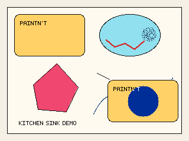

# Paintn't



A tiny headless paint-style graphics library for TypeScript.

`Paintn't` provides a simple in-memory bitmap API inspired by classic paint programs, designed for code, tests, servers, generators, bots, and retro tooling.

It does not ship with a GUI. You manipulate pixels, selections, shapes, text, transforms, and clipboard-like operations entirely through code.

## Features

- In-memory bitmap canvas
- RGBA color model (with alpha)
- Simple built-in bitmap font system (deterministic)
- Pencil, brush, airbrush, fill, line, curve, rectangle, ellipse, polygon, rounded rectangle, text
- Rectangular and free-form selections
- Select all
- Cut, copy, paste, clear, invert
- Flip, rotate, stretch, skew
- Transparent paste
- Simple clipboard abstraction
- Deterministic headless rendering
- BMP export
- No DOM required

## Installation

```bash
bun add paintnt
```

## Quick start

```ts
import { PaintDocument, Colors } from "paintnt";

const doc = new PaintDocument({
  width: 320,
  height: 200,
  background: Colors.white(),
});

doc.tools.line.draw({
  from: { x: 10, y: 10 },
  to: { x: 100, y: 40 },
  color: Colors.black(),
});

doc.tools.rectangle.draw({
  x: 40,
  y: 50,
  width: 80,
  height: 40,
  stroke: Colors.blue(),
  fill: Colors.cyan(),
});

doc.tools.fill.draw({
  x: 50,
  y: 60,
  color: Colors.yellow(),
});

await doc.save("out.bmp");
```

## Design goals

`Paintn't` is intentionally not a Photoshop-style scene graph or layer system.

It is built around a mutable bitmap and a small, direct API:

- draw into pixels
- select regions
- transform regions
- copy/paste regions
- export images

This makes it useful for:

- retro graphics
- bots and procedural image generation
- server-side image editing
- deterministic tests
- educational tools
- recreating classic paint workflows

## Core concepts

### PaintDocument

`PaintDocument` owns the bitmap, current settings, selection, and clipboard-facing operations.

```ts
const doc = new PaintDocument({
  width: 640,
  height: 480,
  background: { r: 255, g: 255, b: 255, a: 255 },
});
```

### Bitmap

A bitmap is a 2D raster image. All drawing operations write pixels directly into the bitmap.

### Selection

Selections are masks (rectangular or free-form). All operations target the active selection if present, otherwise the full canvas.

### Clipboard

Clipboard operations work on image regions, not OS clipboard integration.

### Tools

Tools are stateless helpers attached to a document. They apply drawing commands to the active target (selection or full bitmap).

## Creating a document

```ts
import { PaintDocument } from "paintnt";

const doc = new PaintDocument({
  width: 256,
  height: 256,
  background: "#ffffff",
});
```

## Loading an existing image

```ts
const doc = await PaintDocument.open("sprite.bmp");
```

## Saving

```ts
await doc.save("sprite.bmp");
```

## Colors

All colors are RGBA.

```ts
doc.state.setColor("#ff0000");
doc.state.setFillColor({ r: 0, g: 128, b: 255, a: 255 });
doc.state.setBackgroundColor("#ffffff");
```

Invalid color inputs throw errors.

## Pencil

```ts
doc.tools.pencil.draw({
  points: [
    { x: 1, y: 1 },
    { x: 2, y: 1 },
    { x: 3, y: 2 },
  ],
  color: "#000000",
});
```

## Brush

```ts
doc.tools.brush.draw({
  points: [
    { x: 10, y: 10 },
    { x: 14, y: 13 },
    { x: 20, y: 18 },
  ],
  shape: "square",
  size: 4,
  color: "#222222",
});
```

## Airbrush

```ts
doc.tools.airbrush.draw({
  center: { x: 64, y: 64 },
  radius: 12,
  density: 0.4,
  color: "#444444",
  seed: 1234,
});
```

A fixed `seed` gives deterministic output.

## Fill

```ts
doc.tools.fill.draw({
  x: 20,
  y: 20,
  color: "#00ff00",
  tolerance: 0,
});
```

## Line

```ts
doc.tools.line.draw({
  from: { x: 0, y: 0 },
  to: { x: 100, y: 100 },
  color: "#000",
  thickness: 1,
});
```

## Curve

```ts
doc.tools.curve.draw({
  from: { x: 10, y: 40 },
  to: { x: 120, y: 40 },
  control1: { x: 50, y: 0 },
  control2: { x: 80, y: 80 },
  color: "#000",
  thickness: 1,
});
```

## Rectangle

```ts
doc.tools.rectangle.draw({
  x: 10,
  y: 10,
  width: 80,
  height: 50,
  stroke: "#000000",
  fill: "#ffcc00",
});
```

## Rounded rectangle

```ts
doc.tools.roundedRectangle.draw({
  x: 20,
  y: 20,
  width: 100,
  height: 60,
  radius: 8,
  stroke: "#000",
  fill: "#eee",
});
```

## Ellipse

```ts
doc.tools.ellipse.draw({
  x: 40,
  y: 40,
  width: 60,
  height: 40,
  stroke: "#000",
  fill: "#00ffff",
});
```

## Polygon

```ts
doc.tools.polygon.draw({
  points: [
    { x: 30, y: 10 },
    { x: 60, y: 30 },
    { x: 55, y: 70 },
    { x: 20, y: 50 },
  ],
  stroke: "#000",
  fill: "#ff00ff",
});
```

## Text

Text rendering uses a built-in bitmap font for deterministic output.

```ts
doc.tools.text.draw({
  x: 8,
  y: 8,
  text: "HELLO",
  color: "#000",
  background: "transparent",
});
```

## Selection API

## Rectangular selection

```ts
doc.selection.setRectangle({
  x: 10,
  y: 10,
  width: 32,
  height: 32,
});
```

## Free-form selection

```ts
doc.selection.setMask({
  bounds: { x: 0, y: 0, width: 100, height: 100 },
  isSelected(x, y) {
    return (x - 50) ** 2 + (y - 50) ** 2 < 20 ** 2;
  },
});
```

## Select all

```ts
doc.selection.selectAll();
```

## Clear selection

```ts
doc.selection.clear();
```

## Clipboard operations

## Copy

```ts
const clip = doc.edit.copy();
```

## Cut

```ts
const clip = doc.edit.cut();
```

## Paste

```ts
doc.edit.paste(clip, {
  x: 100,
  y: 50,
  transparent: true,
});
```

## Paste from another document

```ts
const src = await PaintDocument.open("source.bmp");
const region = src.edit.copy({ x: 0, y: 0, width: 32, height: 32 });

doc.edit.paste(region, { x: 10, y: 10 });
```

## Clear selected region

```ts
doc.edit.clear({
  color: "#ffffff",
});
```

## Image operations

All image operations apply to the active selection if present, otherwise the full canvas.

## Invert colors

```ts
doc.image.invert();
```

## Flip

```ts
doc.image.flipHorizontal();
doc.image.flipVertical();
```

## Rotate

```ts
doc.image.rotate(90);
doc.image.rotate(180);
doc.image.rotate(270);
```

## Stretch

```ts
doc.image.stretch({
  scaleX: 2,
  scaleY: 1.5,
  interpolation: "nearest",
});
```

## Skew

```ts
doc.image.skew({
  xDegrees: 12,
  yDegrees: 0,
  background: "#ffffff",
});
```

## Resize canvas

```ts
doc.image.resizeCanvas({
  width: 800,
  height: 600,
  anchor: "top-left",
  fill: "#ffffff",
});
```

## Bitmap attributes

```ts
const attrs = doc.image.getAttributes();
// { width, height }
```

## State API

The document can maintain a current drawing state.

```ts
doc.state.setColor("#000");
doc.state.setFillColor("#0ff");
doc.state.setBrushSize(3);
doc.state.setBrushShape("round");
doc.state.setTransparentPaste(true);
```

Tools may omit repeated values:

```ts
doc.tools.line.draw({
  from: { x: 0, y: 0 },
  to: { x: 20, y: 20 },
});
```

## Exporting raw data

```ts
const rgba = doc.bitmap.toRGBA();
const bytes = await doc.encode("bmp");
```

## Extending the built-in font

The shipped font is intentionally simple. Users can supply their own `BitmapFont` to `doc.tools.text.draw(...)`, or construct one with `createBitmapFont(...)`.

## Development

```bash
bun install
bun test
bunx tsc --noEmit
```

## TypeScript API overview

```ts
export type ColorInput =
  | string
  | { r: number; g: number; b: number; a?: number };

export interface Point {
  x: number;
  y: number;
}

export interface Rect {
  x: number;
  y: number;
  width: number;
  height: number;
}

export interface PaintDocumentOptions {
  width: number;
  height: number;
  background?: ColorInput;
}

export class PaintDocument {
  constructor(options: PaintDocumentOptions);

  static open(path: string): Promise<PaintDocument>;

  readonly bitmap: Bitmap;
  readonly state: PaintState;
  readonly tools: ToolRegistry;
  readonly selection: SelectionManager;
  readonly edit: EditManager;
  readonly image: ImageManager;

  save(path: string): Promise<void>;
  encode(format: "bmp"): Promise<Uint8Array>;
}
```

## Supported operations

- new/open/save
- cut/copy/paste
- clear
- select all
- rectangular selection
- free-form selection
- transparent paste
- pencil
- brush
- airbrush
- eraser
- color picker
- fill
- line
- curve
- rectangle
- polygon
- ellipse
- rounded rectangle
- text
- flip horizontal
- flip vertical
- rotate 90/180/270
- stretch
- skew
- invert colors
- resize canvas / bitmap attributes

## Eraser semantics

The eraser writes a target color (default: background color).

```ts
doc.tools.eraser.draw({
  points: [{ x: 5, y: 5 }, { x: 6, y: 5 }],
  size: 8,
  color: doc.state.backgroundColor(),
});
```

## Color picker

```ts
const color = doc.tools.colorPicker.pick({ x: 10, y: 10 });
doc.state.setColor(color);
```

## Determinism

All operations are deterministic given the same inputs and seed values.

## Error handling

- Out-of-bounds coordinates are no-ops
- Invalid colors throw errors

## Runtime support

- Bun

This version is Bun-first on purpose. The in-memory bitmap APIs are portable, but file I/O helpers like `open()` and `save()` currently target Bun so the package can stay build-free for now.

## FAQ

### Does it have layers?

No.

### Does it need Canvas or the DOM?

No.

### Can I use it in a web app?

Yes.

### Does text rendering vary across platforms?

No. The built-in bitmap font is deterministic.

## License

MIT
